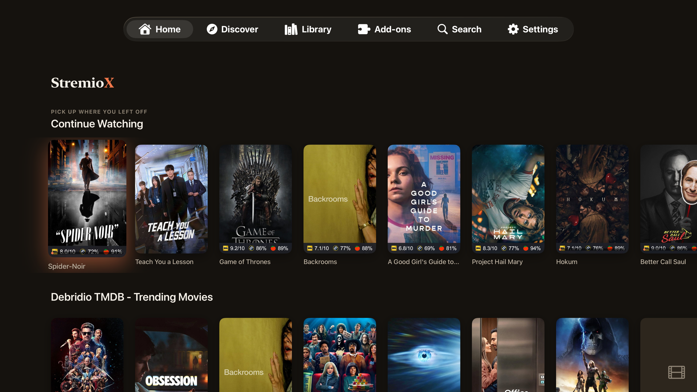
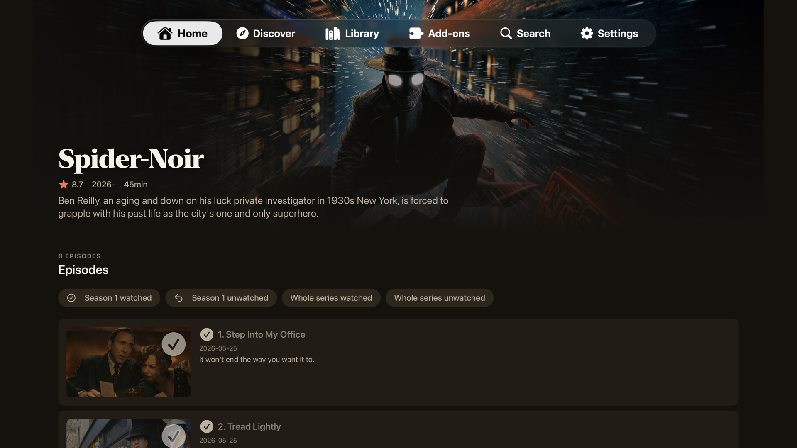
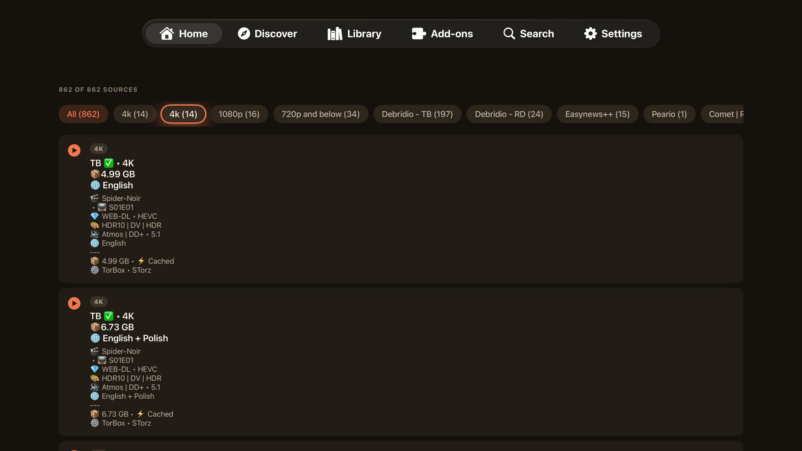
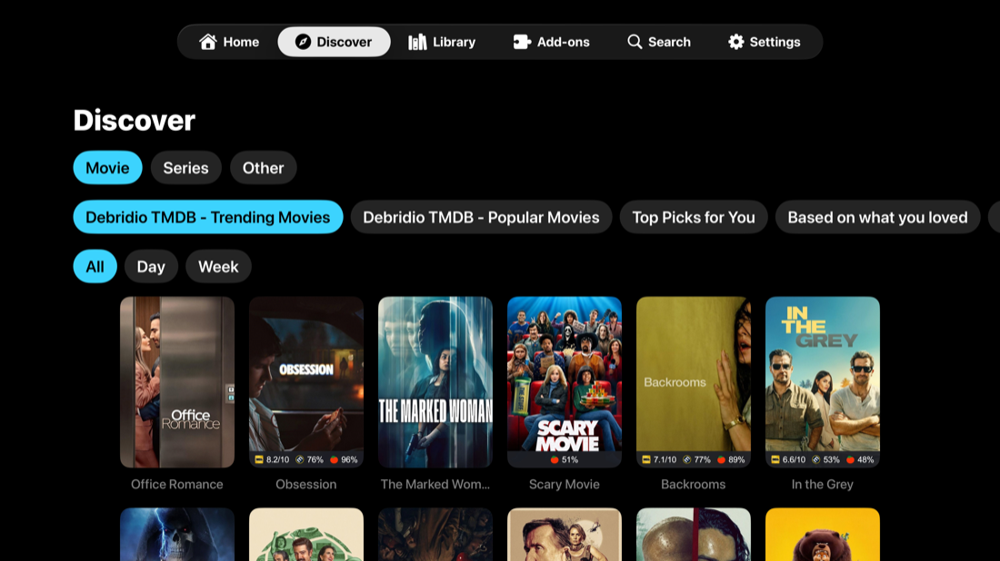
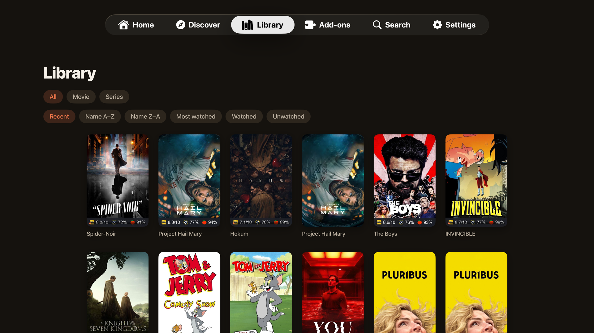
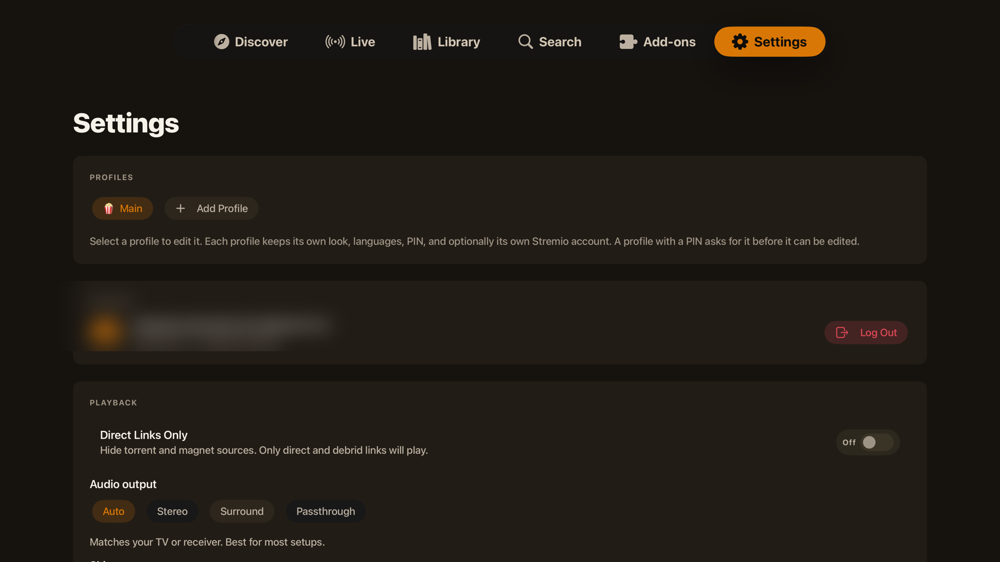
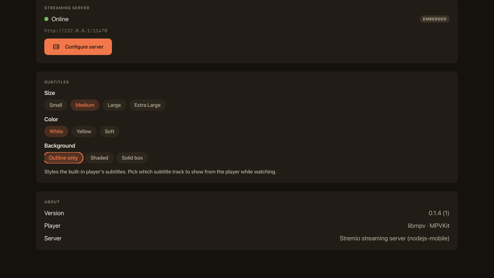
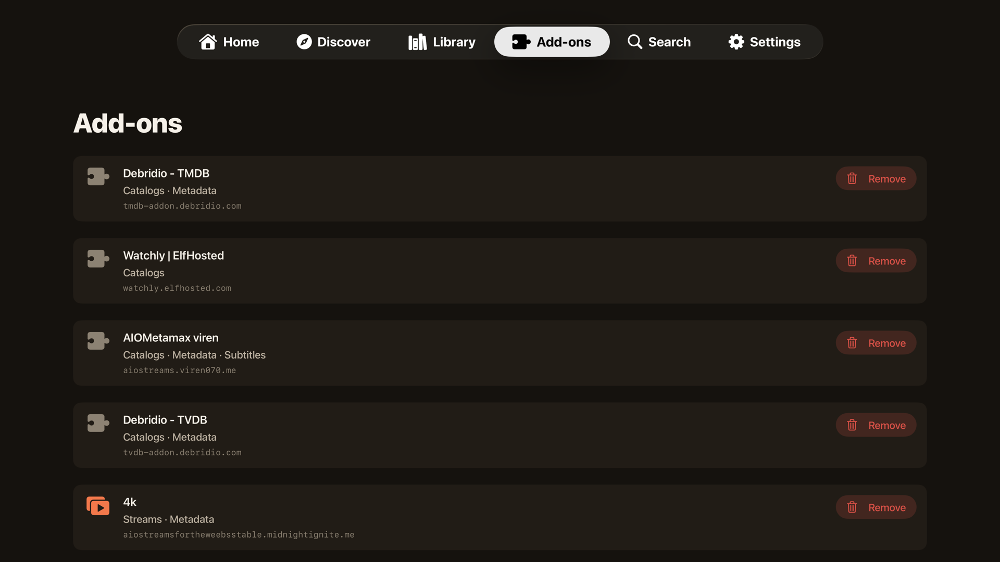

<p align="center">
  
</p>

<p align="center">
  <strong>Everything. VortXed.</strong><br>
  Video, Audio, Live TV. Native on every screen.
</p>

<p align="center">
  <a href="https://github.com/VortXTV/VortX/releases/latest"></a>
  <a href="https://github.com/VortXTV/VortX/releases/latest"></a>
  <a href="https://github.com/VortXTV/VortX/blob/main/LICENSE"></a>
  
</p>
<p align="center">
  <a href="https://www.reddit.com/r/Vortx"></a>


# VortX

VortX is the native streaming app for Apple TV, iPhone, iPad, and Mac. Fully native apps built on a native Rust engine and the libmpv player, with no web wrapper. **Android is here too, in beta** (one build for phone and Android TV, as a sideload APK), alongside the four Apple apps, with desktop (Windows, Linux, Mac) and more on the way.

## New in the 0.3.14 line

0.3.14 is the correctness line, and it carries the biggest Android release VortX has shipped, in one beta. On Apple, the headline is the end of wrong-episode playback: episode identity is now proven end to end, so the episode you pick is the one that plays, the one whose details you see, and the one your progress saves to, even when a season pack, a cached debrid source, or a fast episode switch used to confuse them. Around it, the field reports from Beta 3 are fixed (Continue Watching coming back empty on #149, add-on subtitles returning with an optional my-languages filter on #148, subtitles no longer stuck on Loading, and Dolby Vision holding instead of dropping to HDR10), and the last pre-glass Apple surfaces move onto the shared glass design. Earlier in the line came **Trakt and SIMKL** as first-class integrations, **Plex, Jellyfin, and Emby** servers as source and catalog providers, **bring-your-own Live TV** (M3U and Xtream with EPG), **Smart source selection**, an Apple TV **Top Shelf**, and **Match Frame Rate** for judder-free 24p, across the Apple apps.

And Android arrives in the same beta, as a sideload APK for phone and Android TV:

- **VortX account sign-in with realtime profile sync**: your profiles, other members' watch overlays, and profile deletions sync live with your other devices, on the same account and encryption as everywhere else. Sign-in on the TV itself, plus library, settings, and API-key sync, are still being ported.
- **An in-process torrent streaming server**, so raw torrent sources play directly on the same engine lane the Apple apps use. Phone and TV.
- **A first Android TV experience**: a 10-foot leanback surface with Home, Detail, and playback, plus Discover, Library, Search, and Settings.
- **Profiles** with per-profile watch isolation, **preference-driven source ranking**, **offline downloads** (phone and tablet), **IPTV playlists** (M3U and Xtream with an XMLTV guide), **Picture-in-Picture with gesture controls and system media integration** (phone), **1080p trailers and subtitle fetching**, and a long list of **player fixes**.

Detail for every platform is in [CHANGELOG.md](CHANGELOG.md).

## Backup, restore, and sync

Three layers, so your setup always follows you:

- **Your account already syncs the big things.** Your library, add-ons, and watch history live with your Stremio account and come back on any device the moment you sign in. That is automatic and does not change.
- **Backup & Restore covers what the account does not hold.** Your profiles, theme, player preferences, source filters, and server settings are local to each device. On iPhone, iPad, and Mac, open **Settings > Backup & Restore > Create Backup** to save all of that to a single file. No passwords are included: your account token stays in the Keychain and is never written to the file. **Restore** reads it back, including into a fresh install or into VortX after the deeper move. Keep the file somewhere safe (Files, iCloud Drive, AirDrop to another device).
- **Apple TV, and where sync is heading.** tvOS has no file access, so a scan-with-your-phone backup is on the way: **Backup** shows a QR code, you scan it with your phone and sign in to a VortX account, and your settings save there; **Restore** shows another code to pull them straight back. That same mechanism becomes **VortX cloud sync**, so in time even local profiles and preferences sync across all your devices, the one gap the Stremio account does not cover today. It is built to carry over unchanged when VortX moves to its own core and server.

## Why this exists

Apple hardware deserves a modern, native, actively developed streaming app, and Apple TV especially had been left behind. The native options stopped getting updates and went stale while the platform moved on, and the Apple TV experience stayed feature limited. Apple users, and Apple TV users especially, were left on an old build.

VortX is that app. It is a modern, native, actively developed streaming app for Apple TV, iPhone, iPad, and Mac, built on a native Rust engine and a real libmpv player, with no web wrapper. The aim is simple: the best native experience on Apple hardware, and the foundation for the best one anywhere. It is an independent project, not affiliated with anyone.

A small but growing group of community contributors has pitched in too (see Credits).

## Two builds: VortX and VortX Lite

The Apple TV release ships in two flavors. Pick one; they are the same app otherwise, and your account, profiles, and settings are identical between them.

|                                                                                    | **VortX**                              | **VortX Lite**                                                   |
| ---------------------------------------------------------------------------------- | -------------------------------------- | ---------------------------------------------------------------- |
| File                                                                               | `VortX-tvOS-x.y.z.ipa` (~48 MB)        | `VortX-tvOS-lite-x.y.z.ipa` (~31 MB)                             |
| Torrents and magnets                                                               | Yes, via the embedded streaming server | No, cannot play them at all                                      |
| Embedded streaming server                                                          | Bundled and running                    | Not bundled                                                      |
| Direct and debrid links (Real-Debrid, TorBox, Premiumize, usenet resolved to http) | Yes                                    | Yes                                                              |
| Best for                                                                           | Everyone who wants torrent support     | Debrid-only users who never want a peer connection without a VPN |

**Why a Lite build exists.** When you play a torrent your device joins a peer-to-peer swarm, and your IP is visible to everyone in it. Debrid and direct links are ordinary HTTPS downloads with none of that exposure. If you only ever stream through a debrid service, the Lite build removes the torrent engine entirely, so there is no way to accidentally start a peer connection, and the app is smaller and starts faster.

**You do not need the Lite build to get this safety.** VortX itself has a **Direct Links Only** switch in Settings that hides every torrent and magnet source and keeps the engine off. The Lite build is simply that choice made permanent, for people who would rather the capability not be present at all.

## What it looks like (Apple TV)

Home, with your real Continue Watching and every catalog from your add-ons. The background is alive: whichever title you focus fills the screen with its artwork and details, and rows fade out underneath as you browse deeper. The focused card carries a soft glow in your accent color, so it is always clear where you are.



Series pages open ready to play. A Resume or Play button on the hero jumps to the right episode, an **Add to Library** chip saves it for later, and the episode list sits below with watched ticks, progress stripes, and per-season and whole-series bulk controls under a long press or the `...` menu.



Episode pages get the full-bleed cinematic treatment: the still owns the screen with the air date, runtime, rating, and synopsis over it, and Watch Now ranks every source as your add-ons answer. The full ranked list ("All sources") and a two-level Quality picker are one button away.



In the player, a Playback panel holds speed control, a live playback-info overlay, and a **stream link as a QR code** you can scan with your phone to keep watching there. The player switches the Apple TV into real HDR and Dolby Vision modes, skips intros and credits, recovers from stalls on its own, and lets you jump to another source without leaving.


Discover and Library, with proper type, catalog, genre, and sort filters, and the same living backdrop.





Profiles, free. Each one has its own look, its own watch history, an optional PIN, and optionally its own account. A "Who's watching?" picker greets you at launch when more than one exists.



Settings: profiles, account, the playback mode (Direct Links Only), the embedded streaming server with a one-press Restart, appearance, and player preferences in one place.



Add-ons you have installed are listed and removable right in the app.



## What you get

Every Apple app is fully native and runs on a native Rust engine, compiled straight in. There is no web wrapper anywhere: Apple TV, iPhone, iPad, and Mac are all the real engine, the real native UI, and the native libmpv player (MPVKit-GPL). Because the real engine does the work, your catalogs, library, and Continue Watching come out right instead of being stitched together by hand. Torrents stream through the embedded streaming server, which now ships on the Mac too.

**Apple TV, iPhone, iPad, and Mac are at parity.** The cinematic detail page, ranked Watch Now with the two-level quality picker, per-add-on source grouping, an interactive auto-rotating featured hero with a muted in-hero trailer, full Settings, profiles, themes, subtitle styling, and **Live TV** are on every Apple device. Where a platform has a natural extra, it gets it: trailers play through the embedded server on Apple TV and an in-app player on iPhone, iPad, and Mac.

**Android is in beta, and desktop is in active development**, both on the same shared engine. The Android app covers phone and Android TV and ships now as a sideload APK, with VortX account sign-in and realtime profile sync, an in-process torrent server, preference-driven source ranking, offline downloads, IPTV playlists, and Picture-in-Picture; sign-in on the TV itself and the remaining library, settings, and API-key sync are still being ported. The native desktop app for Windows, Linux, and Mac (via Tauri, with its own embedded torrent server) is not shipped yet.

Everything the apps do today (Apple TV shown; iPhone, iPad, and Mac are at parity unless noted):

**Browsing**

- Home with your real Continue Watching and every catalog from every installed add-on, built by the official engine so they match the official apps.
- An interactive auto-rotating featured hero on Home, Library, and Discover: it cycles the top titles, shows the logo, rating, year, runtime, genres, and synopsis over the artwork, and plays a muted trailer behind it; focus or tap a poster to feature it, again to open. Reduced-motion aware.
- A living backdrop on Home, Discover, and Library: whichever title you focus fills the screen with its real backdrop art, year, rating, runtime, genres, and synopsis, with rows tucking away underneath as you browse deeper.
- **Live TV**: channels from your installed tv / IPTV add-ons get their own tab, rendered as logo channel tiles with the same living backdrop, with a now/next strip from the channel's EPG schedule on the detail page and live-tuned playback. (A full channel guide and M3U import are on the roadmap.)
- A theme-colored focus glow on every poster across Home, Discover, and Library, so the focused card reads at a glance from across the room.
- Full-bleed movie and episode pages: the artwork owns the screen, details sit over it, episode pages show the still, air date, runtime, rating, and synopsis.
- Series pages open ready to play: a Resume or Play button on the hero jumps to the right episode (in progress, or first unwatched), and the episode list opens on that season. Contributed by [OrigamiSpace](https://github.com/OrigamiSpace).
- Partly watched episodes show a progress stripe; watched episodes show a tick. Per-season and whole-series watched and unwatched controls live in a long-press menu on the season chips and in a visible `...` menu.
- **Add to Library / Watch Later**: an Add to Library chip on every movie and series page saves a title for later, reflecting the engine's own saved state so it stays correct everywhere.
- Discover with type, catalog, and genre filters; Library with type and sort filters; search across your add-ons; add-on management built in.
- Long-press menus on posters everywhere: dismiss from Continue Watching or open its full **Details** page, add to or remove from the library, mark watched or unwatched by episode, season, or series. Finished titles leave Continue Watching on their own.

**Continue Watching that just plays**

- Click a Continue Watching card and it resumes the exact stream you were on, at the exact position, straight into the player, with no detour through the detail page.
- A **Details** option in the long-press menu opens the full page when you do want to pick a different episode or quality.
- The exact link is remembered per profile; expired debrid links fall into the player's retry screen.

**Sources**

- Watch Now: every source from every add-on is ranked (cached and direct first, then resolution, remux, HDR) and one press plays the best. The button stays greyed with a live add-on counter until your sources finish answering, so it always plays the best of everything, not the best of whatever loaded first.
- A two-level Quality picker: choose the tier (4K, 1080p, 720p, Others), then the flavor inside it (Dolby Vision, DTS-HD, BluRay, Atmos, WEB and the rest), each labeled with its file size, duplicates collapsed.
- The full ranked list shows the real detail per source: resolution, remux or BluRay or WEB, DV or HDR, Atmos or DTS-HD, codec, cached, and file size, with the top few per add-on so one add-on returning hundreds can't bury the rest.
- Real-Debrid sources rank last and only play when nothing else exists, since the service purged its cache and throttles.
- **Torrents work.** They stream through the embedded server, which is given the patience a cold swarm needs (with a live peer count and speed under the spinner), and every torrent announces over TCP/TLS trackers as well as the usual ones, so swarms form reliably. Debrid and direct URLs play straight.
- **Play a link**: from Search, paste a direct video URL, a magnet, a bare host, or a debrid or usenet link your service resolved to http(s), and it plays.

**Playback**

- The codecs actually work: TrueHD and Atmos, DTS-HD MA, EAC3, 4K, HDR, and Dolby Vision all play through libmpv, instead of silence or a black screen.
- Real HDR and Dolby Vision output: starting HDR content switches the Apple TV's HDMI link into the content's mode at its native frame rate, your TV lights its HDR or Dolby Vision badge, and the display returns to normal when playback ends. Requires Match Dynamic Range under Settings > Video and Audio > Match Content on the Apple TV.
- A **Dolby Vision / HDR compatibility** toggle for the rare displays where a Dolby Vision Profile 7 remux comes out green or purple: it tone-maps HDR and Dolby Vision down to clean SDR. Off by default.
- A half-gigabyte read-ahead buffer sized to what the Apple TV can actually hold, so 4K remuxes ride out network dips without stalling.
- **Seamless binge**: the next episode is fetched and ranked in the background at the halfway mark, its source is woken up just before the credits so there is no provider cold start, and it locks to the same release group the current stream advertised, so episode two never jumps quality or edition mid-binge.
- **Per-series quality memory**: Watch Now remembers, per series and per profile, the quality you last played and opens in it again. Cached and instant sources still win.
- **Stall recovery**: if the picture freezes while it is not buffering, the player reloads the stream in place at your position; if a source keeps stalling, you land on the source list instead of a dead screen. You can also switch to another source mid-playback, and a failed stream offers the source list in one press.
- **Live streams play properly**: live TV and event streams keep playing across segment boundaries instead of ending a few seconds in, with buffering tuned for live playlists. Contributed by [OrigamiSpace](https://github.com/OrigamiSpace).
- **Trailers on every device**: a Trailer button on the detail page, plus the muted autoplay behind the featured hero. Apple TV plays trailers through the embedded server; iPhone, iPad, and Mac use an in-app player. (Not the Lite build.)
- **Subtitles from your add-ons**: the subtitles panel lists what your installed subtitle add-ons offer next to the file's embedded tracks; pick one and it loads on the spot.
- **Stream link QR**: the player settings panel shows the playing stream as a QR code (a magnet for torrents), to scan with your phone and keep watching there.
- Playback speed control, a live playback-info overlay (resolution, codec, hardware decode, FPS, dropped frames, buffer), skip intro / recap / credits (crowd-sourced timestamps merged with the file's chapter markers, with sanity guards), smart audio and subtitle selection from your preferred languages, language-grouped track pickers, subtitle styling and sync, bundled fonts for every script, a seekable scrubber with accelerating hold-to-seek, fit / zoom / stretch aspect modes, and resume across sessions.
- Live progress flows back to your account while you watch, so Continue Watching is correct on every device, and the watched marker flips automatically near the end.

**Profiles**

- A "Who's watching?" picker at launch when more than one profile exists, with no flash of the wrong profile's Home before it.
- Each profile keeps its own name, avatar, accent theme, and background; switching re-themes the whole app instantly.
- Each profile keeps its OWN watch history: its own Continue Watching, resume positions, and watched markers, invisible to the others.
- An optional 4-digit PIN gates any profile, stored as a salted hash so it can be changed but never read back; editing another profile that has a PIN asks for that PIN first.
- Audio language, subtitle language, and subtitle style follow the profile: set once per viewer, applied on switch, synced across devices. Requested by [heinzgruber](https://github.com/heinzgruber).
- A profile can share the main account or sign into its own; switching keeps every session valid.
- Sign in by scanning a QR code with your phone instead of typing a password with the remote; password sign-in stays as a fallback. Contributed by [OrigamiSpace](https://github.com/OrigamiSpace).
- Profiles and their history are per-device for now; cross-device sync returns once VortX has its own sync channel, planned on the roadmap.

**The rest**

- Eight accent themes plus a true-black OLED mode; the whole app, including the focused tab, repaints live when you switch.
- Direct Links Only toggle to hide torrents and keep the engine off (the Lite build makes this permanent).
- A one-press Restart in Settings, since Apple TV has no force quit, to bring the embedded server back if it ever needs it.
- An in-app update notice that checks for new releases and tells you when one is out.
- A branded launch splash that honors Reduce Motion, a screen that stays awake during playback and sleeps when paused, and the option to point at your own streaming server.

## Installing

The builds are attached to the [latest release](../../releases/latest): the **iOS IPA** (covers both iPhone and iPad), two **Apple TV IPAs** (the `VortX-tvOS-x.y.z.ipa` build with torrents, and the smaller **Lite** build `VortX-tvOS-lite-x.y.z.ipa` for debrid and direct links only, see "Two builds" above), the **macOS app** as a `.dmg`, and the **Android APK** `VortX-Android-vx.y.z.apk` (one build for phone and Android TV). None of this requires a jailbreak.

**Is it safe, and why the extra setup?** VortX is open-source and handed out here on GitHub, not through the App Store, and it is not yet signed with an Apple Developer identity (that needs a paid Apple Developer account, which is on the roadmap). Because Apple does not recognize the signature, iPhone, iPad, and Apple TV need the app re-signed with an Apple ID before they will run it, and macOS shows a "could not verify it is free of malware" warning the first time you open it. That warning means "Apple does not know who signed this," not that anything is wrong: every line of code is in this repository, the binaries are built by the public GitHub Actions workflow in [.github/workflows](.github/workflows) so you can read exactly what goes into them, and you can build them yourself (see "Building it yourself" below). Once there is a Developer ID, the Mac app gets notarized, the warning disappears, and the apps may move to TestFlight or the App Store.

**iPhone, iPad, and Apple TV** use one of Methods 1 to 4 below; the signing identity you pick sets how long each install lasts. **macOS** and **Android** are simpler (no re-signing, no expiry) and each have their own section at the end.

### The trade-off to understand first

Apple only runs apps signed by a valid identity, and what you sign with decides how long the install lasts:

- **A free Apple ID** signs for **7 days** at a time, then the app stops opening until you re-sign it (your settings and sign-in survive, it is just the signature that expires).
- **A paid Apple Developer account** ($99/year) signs for **1 year**.
- **A signing service** (Signulous, and similar) uses its own developer identity to give you 1-year installs without owning a developer account, for roughly $20/year per device.

### Method 1: Signulous (easiest, what I use, works for all three devices)

1. Go to [signulous.com](https://www.signulous.com), buy a device registration, and follow their steps to register your iPhone, iPad, or Apple TV (for Apple TV they walk you through finding its UDID).
2. Wait for the registration to be processed (usually under an hour, can take a few).
3. Open their upload page, upload the VortX IPA, and it appears in your personal library.
4. On the device, open the install link they give you and install. On Apple TV, installation happens over the browser flow they provide.
5. Signed for a year. When a new version ships, upload the new IPA and install over the top; your sign-in and settings stay.

### Method 2: Sideloadly (free, iPhone, iPad, and Apple TV)

1. Download [Sideloadly](https://sideloadly.io) on your Mac or Windows PC and install it.
2. iPhone or iPad: connect over USB (or enable Wi-Fi sync in Finder/iTunes first and do it wirelessly).
3. Apple TV: make sure it is on the same network. In Sideloadly it appears as a network device. On newer tvOS you may need to pair first: on the Apple TV go to Settings, then Remotes and Devices, then Remote App and Devices, and keep that screen open while Sideloadly connects.
4. Drag the IPA into Sideloadly, enter your Apple ID (a throwaway is fine and keeps your main account clean), and press Start.
5. First time only, on iPhone and iPad: Settings, then General, then VPN and Device Management, tap your Apple ID, and tap Trust.
6. With a free Apple ID the app runs for 7 days; re-run Sideloadly to re-sign, nothing inside is lost. A paid developer account runs for a year.

### Method 3: AltStore or SideStore (free, iPhone and iPad only, auto re-sign)

1. Install [AltStore](https://altstore.io) (needs AltServer on a computer on your network) or [SideStore](https://sidestore.io) (after setup, no computer needed).
2. Add the IPA through the app (in AltStore: My Apps, the plus button, pick the IPA).
3. These re-sign automatically in the background, so the 7-day limit takes care of itself as long as the device sees AltServer once a week (AltStore) or periodically (SideStore).
4. Neither supports Apple TV.

### Method 4: Xcode (free, for developers, all devices)

1. On a Mac with Xcode, open Window, then Devices and Simulators. Connect iPhone or iPad over USB; pair the Apple TV over the network (it shows under Discovered and displays a pairing code).
2. Drag the IPA onto the device, or re-sign with your personal team first using [ios-app-signer](https://dantheman827.github.io/ios-app-signer/) if Xcode refuses the unsigned IPA.
3. Free Apple ID signs for 7 days, paid developer account for a year.

### macOS (the .dmg): one-time setup, no re-signing

The Mac app does not expire and needs no Apple ID or re-signing. You clear Apple's download quarantine once, because the app is signed ad-hoc rather than with a Developer ID (yet).

1. Open the downloaded `.dmg` and drag **VortX** into your **Applications** folder. (Run it from Applications, not from inside the mounted disk image.)
2. The first time you open it, macOS says **"VortX Not Opened, Apple could not verify it is free of malware."** That is expected for any app not signed with an Apple Developer ID; see the safety note above. Get past it one of two ways:
   - **System Settings** (the only built-in way on macOS 15 Sequoia, where Apple removed the old right-click then Open shortcut): try to open VortX once so the warning appears, then go to **System Settings, then Privacy & Security**, scroll to the bottom, and click **Open Anyway** next to the VortX line. Confirm with Touch ID or your password, and it launches.
   - **Terminal** (works on every version, and is the fastest): run `xattr -dr com.apple.quarantine /Applications/VortX.app`, then open the app normally.
3. After that first launch it opens like any other app, forever. To update, drag the new release's app over the old one in Applications and clear the quarantine again.

Torrents work on the Mac too (it bundles the streaming server). If you only use debrid or direct links, turn on **Direct Links Only** in Settings.

### Android (the .apk): sideload and open

The Android app is a single APK that runs on both phone and Android TV. It is a beta, debug-signed for testing, so there is no Play Store listing yet. On Android TV or Fire TV, the quick way is the **Downloader** app: enter **`dl.vortx.tv`** and it always fetches the newest APK.

1. From the [latest release](../../releases/latest), download `VortX-Android-vx.y.z.apk`.
2. Open it from your browser or a file manager, and allow installs from that app when Android prompts (unknown-source installs stay blocked until you allow that one app).
3. Open VortX and sign in with your VortX account.

To update, download the newer APK and install it over the top; your sign-in and settings carry over.

### Updating

Install the new version's IPA over the old one with the same method and the same Apple ID; your sign-in, profiles, and settings carry over. If you switch signing identities, iOS treats it as a different app and you start fresh. You can move between the two builds the same way.

## Security and privacy

Reasonable questions for any unsigned build, so here is the straight version:

- It is unsigned on purpose. You re-sign it with your own identity, so nothing here runs under my signature.
- What the Apple TV app talks to: the official account API (api.strem.io) to sign in and sync, the add-ons you have installed, and whichever streaming server you point it at. Nothing else. No analytics, no telemetry, no third-party trackers.
- Your account token is kept in the device Keychain, not in plain preferences, and only ever goes to the official API.
- Each release lists SHA-256 checksums next to the assets, and a verified `-ci` build, compiled from source on GitHub's runners, is attached so you can confirm the published binary really comes from this code.
- You do not have to take my word for any of it. The full source is here, and you can build the IPA yourself.

## It comes with nothing

You sign in with your own account and bring your own add-ons. No content is bundled and no add-ons are bundled. What you watch, and whether it is legal where you live, is on you.

## Built with

- **Swift + SwiftUI**: the entire UI on Apple TV, iPhone, iPad, and Mac, with no web wrapper.
- **Native Rust engine**: the open-source `stremio-core` crate (catalogs, add-ons, library, streams), linked as `StremioXCore.xcframework` and driven over a JSON/C bridge.
- **libmpv via [MPVKit](https://github.com/mpvkit/MPVKit)**: the video player, with HDR and Dolby Vision tonemapping, track selection, and libass subtitles.
- **nodejs-mobile**: the embedded streaming server (`server.js`) for torrents and the header-gated proxy, in the builds with the embedded server.
- **XcodeGen**: the project is generated from `app/project.yml`, the checked-in source of truth.
- **GitHub Actions**: builds and publishes the unsigned IPAs and the macOS `.dmg` from source.
- **Kotlin + Jetpack Compose**: the Android phone and TV apps (`android/`), now in beta on the same shared engine.

## Building it yourself

**Most people do not need this.** VortX's engine layer is proprietary and now lives in a private repo, so a full from-source build requires access to that engine repo and is available only to the project maintainers. If you just want to run VortX, download the prebuilt, unsigned IPA (and the macOS `.dmg`) from the [Releases](https://github.com/VortXTV/VortX/releases) page and sideload it the usual way. That is the supported path, and it is always the latest build. The public repo here holds the app itself; the engine step below stops with `stremiox-core crate not found` without engine access, so the rest of this section is for maintainers who have it.

You'll need macOS with Xcode, [XcodeGen](https://github.com/yonaskolb/XcodeGen), and Rust nightly with rust-src (the native engine now powers Apple TV, iPhone, iPad, and Mac). MPVKit comes in over Swift Package Manager. No local streaming-server install is needed: the fetch script downloads everything it cannot find.

```bash
# 1) Streaming-server deps: NodeMobile (tvOS-enabled build from this repo's vendor
#    release), server.js (from a local Stremio.app if present, otherwise the
#    public CDN), and the bundled subtitle fallback fonts.
./scripts/fetch-server-deps.sh

# 2) Build the engine into an xcframework (needs Rust nightly + rust-src AND access to the
#    private stremiox-core engine repo: set STREMIOX_CORE_DIR, or clone it to ../../stremiox-core).
#    Maintainers only. Without engine access this stops with "stremiox-core crate not found".
#    Produces the tvOS, iOS, and macOS slices the native apps link.
./scripts/build-core-xcframework.sh

# 3) Generate the project and build (unsigned, for sideloading)
cd app && xcodegen generate
# Apple TV build with torrents:
xcodebuild -scheme VortXTV         -sdk appletvos -destination 'generic/platform=tvOS' -configuration Release CODE_SIGNING_ALLOWED=NO build
# Lite Apple TV build (no embedded server):
xcodebuild -scheme VortXTVLite     -sdk appletvos -destination 'generic/platform=tvOS' -configuration Release CODE_SIGNING_ALLOWED=NO build
# Native iPhone and iPad build:
xcodebuild -scheme VortXiOSNative  -sdk iphoneos  -destination 'generic/platform=iOS'  -configuration Release CODE_SIGNING_ALLOWED=NO build
# Native Mac build:
xcodebuild -scheme VortXMac        -destination 'platform=macOS,arch=arm64'            -configuration Release CODE_SIGNING_ALLOWED=NO build

# 4) Wrap a built .app into an .ipa (Apple TV / iOS)
./scripts/repackage-ipa.sh <dir-with-Payload> build/VortX.ipa
```

(The legacy `VortX` iOS web-host target and its `./scripts/build-web.sh` bundle step still build for now, but the native `VortXiOSNative` app has replaced it.)

`server.js` is not committed here because it is the streaming server's own proprietary file. The script prefers a copy from a local Stremio.app (set `STREMIO_APP` to point at one) and otherwise downloads the standard desktop build from the public CDN, so a fresh clone builds without any local install.

## How the tvOS app works

It started out talking to add-ons by hand, and that kept getting small things wrong, so it was moved onto a native Rust engine. The engine is built as a static library, packaged as StremioXCore.xcframework, and talks to Swift as plain JSON over a C interface (see the `core/` folder). The SwiftUI screens send the engine actions and render whatever state it hands back, so catalogs, library, and Continue Watching come out right instead of being stitched together by hand. There's more in `docs/REBASE-stremio-core.md`.

## What's next

With native apps across Apple shipping and Android now in beta, the work moves outward and deeper: completing Android (sign-in on the TV itself, the remaining library, settings, and API-key sync, and a Play Store listing), finishing the desktop (Windows, Linux, Mac via Tauri) build on the shared engine, stream intelligence (a trust filter, keyword filters, built-in debrid), a full Live TV channel guide, and, on the path to 1.0, VortX's own engine, streaming server, ranking, and metadata, with a new identity at 1.0. The full plan is in [ROADMAP.md](ROADMAP.md). Every released change is tracked in [CHANGELOG.md](CHANGELOG.md).

Have a feature in mind, or hit a bug? Start a [GitHub Discussion](https://github.com/VortXTV/VortX/discussions) to suggest or talk through an idea, or [open an issue](https://github.com/VortXTV/VortX/issues). Requests genuinely shape the roadmap.

## Known issues

- **Profiles are per-device for now.** The roster and each profile's watch history live on the device. An early build (0.2.7 to 0.2.9 build 30) tried to sync them through the account's library storage; that could break library sync in official apps with a "Serialization error: state.watched" message. Current builds scrub those documents from the account automatically on launch, which fixes the official apps too. If you saw that error, open VortX once on this version and give the official app a minute to resync.
- **Android is in beta, and desktop is still in development.** The Android app ships now as a sideload APK (phone and Android TV) but is not yet at the Apple apps' level of polish, and some sync legs and Android TV sign-in are still being ported. The desktop app runs the shared engine but is not part of the released builds yet.
- **Unsigned builds.** You re-sign the IPA yourself, and depending on the signing method, reinstalling can require signing in again.

## Not affiliated

This is an independent community project. It is not affiliated with or endorsed by Stremio or Apple. All names and trademarks belong to their owners.

## Credits

- [Stremio](https://www.stremio.com/), for stremio-core and the streaming server.
- [mpv](https://mpv.io/) and [MPVKit](https://github.com/mpvkit/MPVKit), for the player.
- [nodejs-mobile](https://github.com/nodejs-mobile/nodejs-mobile), for the embedded server runtime.
- [OrigamiSpace](https://github.com/OrigamiSpace), the first and most prolific community contributor: QR sign-in, live stream playback, live search, the Resume/Play hero and watched-state controls, the tab bar and focus fixes on real hardware, verified CI release builds, the Direct Links Only mode and the VortX Lite build, the stream-ranking reports that drove the cached-first fixes, the build-from-source report that made a fresh clone work for everyone, and the Apple TV search-suggestion interleaving.
- [jbecker-it](https://github.com/jbecker-it), for the player reliability series in 0.3.13: the pause-crash relief, watch progress on durationless streams, the scrub and watched-mark guards, the post-seek audio fix, and the Continue Watching exit refresh, every fix root-caused and verified on real hardware.
- **[SkipDB](https://skipdb.tv)**, the open, community-built skip-segment database, also created by [OrigamiSpace](https://github.com/OrigamiSpace). VortX's skip feature is built on it: we read from it, contribute every submission back to it, and publish our own skip data openly under the same [Open Database License](https://opendatacommons.org/licenses/odbl/) at [skip.vortx.tv/dump](https://skip.vortx.tv/dump). Open projects like this are why the ecosystem works, and VortX is proud to give back to it.

See [THIRD-PARTY-NOTICES.md](THIRD-PARTY-NOTICES.md) for the full list.

## A note on the bundled streaming server

The IPAs that bundle the streaming server include `server.js`, the streaming server's own proprietary file, distributed for free inside the official apps. VortX has not modified it and claims no rights to it; it is bundled only so the app works out of the box. The Lite build omits it entirely. Swapping it for an open-source streaming server is on the [roadmap](ROADMAP.md).

## Star History

<a href="https://www.star-history.com/?repos=VortXTV%2FVortX&type=date&legend=top-left">
 <picture>
   <source media="(prefers-color-scheme: dark)" srcset="https://api.star-history.com/chart?repos=VortXTV/VortX&type=date&theme=dark&legend=top-left&sealed_token=yKzKgEU0KdICBropM1k7qT6Xle5yPHDWjgz54noyNRyzQBn3OKydbicXr8owI-VOzFLbezoB5jWIhEdhLKRC7Rf_VGV3sxZyHglg4UKY81vwSYEedPXXQA" />
   <source media="(prefers-color-scheme: light)" srcset="https://api.star-history.com/chart?repos=VortXTV/VortX&type=date&legend=top-left&sealed_token=yKzKgEU0KdICBropM1k7qT6Xle5yPHDWjgz54noyNRyzQBn3OKydbicXr8owI-VOzFLbezoB5jWIhEdhLKRC7Rf_VGV3sxZyHglg4UKY81vwSYEedPXXQA" />
   
 </picture>
</a>

## Legal and DMCA

VortX is a client-side app: it browses metadata and plays media that **you** supply through the add-ons you install and the sources you provide. It is intended for content you own or are otherwise authorized to access. VortX does not host, store, index, or distribute any media, and it bundles no content and no add-ons. It is an independent project and is not affiliated with or endorsed by Stremio, Apple, or any add-on or content provider.

Because VortX hosts no content, a copyright complaint about a specific stream belongs with the add-on or server actually hosting it, not with this app. For the full disclaimer, third-party add-on policy, and how to file a copyright notice about this repository, see **[docs/LEGAL.md](docs/LEGAL.md)**.

## License

[GPL-3.0](LICENSE), because the app links MPVKit-GPL. The streaming server's own components come from Stremio and remain under their own terms; this repository does not include them, they are fetched at build time.

The code is under that license; the VortX name and logo are not. Forks are welcome and encouraged, but ship yours under its own name and icon rather than as VortX. See [TRADEMARK.md](TRADEMARK.md) for the brand-use policy.

### Contributing and the CLA

Contributions are welcome. See [CONTRIBUTING.md](CONTRIBUTING.md) to get started, and note that merging your first contribution needs a signed [CLA.md](CLA.md), which lets you keep the copyright in your work while the project keeps its licensing options open.
